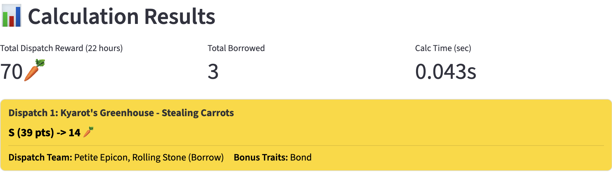

# 🐾 Trickcal: Chibi Go Farm Dispatch Calculator <br> 嘟嘟脸恶作剧农场派遣计算器



[English](#english) | [中文](#中文)

---

## Online App / 在线应用

Click [here](https://trickcal-pet-dispatcher.streamlit.app/) to use the online streamlit app.

点击[此处](https://trickcal-pet-dispatcher.streamlit.app/)使用在线的streamlit应用。

---

## Please Note: Help Needed

⚠️ **Help is needed to update the pets and dispatch missions data for the calculator!**

⚠️ **宠物和任务信息需要帮助更新！**

- 如果你可以帮助更新数据，请先参考[贡献指南](https://github.com/chuyaowang/trickcal-team-optimizer/wiki/Contribution-Guide-CN)! 或在[这里](https://github.com/chuyaowang/trickcal-team-optimizer/discussions/2)加入讨论。
-  If you want to help update the data, please refer to the [Contribution Guide](https://github.com/chuyaowang/trickcal-team-optimizer/wiki/Contribution-Guide) first! Or join the discussion at [this discussion thread](https://github.com/chuyaowang/trickcal-team-optimizer/discussions/2).

📢 Current Status:

- \[GL-CN\]: 国际服（中文）宠物，任务数据已更新 (游戏更新 20260423)
- \[GL-EN\]: Global server (English) pets and missions data updated (Game update 20260423)
- \[CN\]: 中国服的宠物，任务信息已更新 (游戏更新 20260423)。
- \[KR\]: 需要更新。目前的韩服数据和国际服相同，仅做测试用。如果你可以更新数据，请先参考[贡献指南](https://github.com/chuyaowang/trickcal-team-optimizer/wiki/Contribution-Guide-CN)!

---

## English

**trickcal-team-optimizer** is a globally optimal pet assignment calculator for farm dispatch tasks in the game Trickcal: Chibi Go. It uses Mixed Integer Linear Programming (MILP) to find the best possible pet teams to maximize your total 🥕 rewards.

### 🚀 Quick Start

If you have **Miniconda** or **Anaconda** installed, run this in your terminal inside the project folder:

```bash
conda create -n petdispatch python=3.9 -y && conda activate petdispatch && pip install -r requirements.txt
```

### 💻 How to Use

#### 1. Web Interface (Recommended)

Run the modern web-based UI with **Multi-language support**:

```bash
streamlit run src/ui/web_gui.py
```

- **UI Language**: Toggle between English and Chinese in the sidebar.
- **Save/Load Configs**: Download your setup as a `.json` file and reload it instantly later.
- **Results**: View optimized teams directly on the same page.

#### 2. Command Line (CLI)

Run directly using a saved config file:

```bash
python main.py --config your_config.json --lang en
```

### 📖 Documentation

- [User Guide](https://github.com/chuyaowang/trickcal-team-optimizer/wiki/User-Guide)
- [Installation Guide](https://github.com/chuyaowang/trickcal-team-optimizer/wiki/Installation-Guide)
- [Contribution Guide](https://github.com/chuyaowang/trickcal-team-optimizer/wiki/Contribution-Guide)
- [Algorithm Explanation](https://github.com/chuyaowang/trickcal-team-optimizer/wiki/Algorithm-Explanation)
- [Software Architecture](https://github.com/chuyaowang/trickcal-team-optimizer/wiki/Software-Architecture)

---

## 中文

**trickcal-team-optimizer** 是一款针对嘟嘟脸恶作剧农场派遣任务的全局最优宠物分配计算器。它利用混合整数线性规划 (MILP) 算法，自动寻找能够最大化胡萝卜奖励的宠物组合方案。

### 🚀 快速安装

如果您已安装 **Miniconda** 或 **Anaconda**，请在项目文件夹内运行：

```bash
conda create -n petdispatch python=3.9 -y && conda activate petdispatch && pip install -r requirements.txt
```

### 💻 使用说明

#### 1. 网页界面 (推荐)

启动支持**多语言切换**的现代网页版 UI：

```bash
streamlit run src/ui/web_gui.py
```

- **UI语言切换**: 在侧边栏可自由切换中英文界面。
- **保存与读取**: 在侧边栏可以将您当前的宠物配置下载为 `.json` 文件，下次使用时直接上传。
- **彩色面板**: 方案计算结果以不同颜色的卡片显示在输入区域下方。

#### 2. 命令行界面 (CLI)

使用已保存的配置文件直接运行：

```bash
python main.py --config 你的配置文件.json --lang cn
```

### 📖 相关文档

- [用户指南](https://github.com/chuyaowang/trickcal-team-optimizer/wiki/User-Guide-CN)
- [安装指南](https://github.com/chuyaowang/trickcal-team-optimizer/wiki/Installation-Guide-CN)
- [贡献指南](https://github.com/chuyaowang/trickcal-team-optimizer/wiki/Contribution-Guide-CN)
- [算法说明 (英文)](https://github.com/chuyaowang/trickcal-team-optimizer/wiki/Algorithm-Explanation)
- [软件架构 (英文)](https://github.com/chuyaowang/trickcal-team-optimizer/wiki/Software-Architecture)
