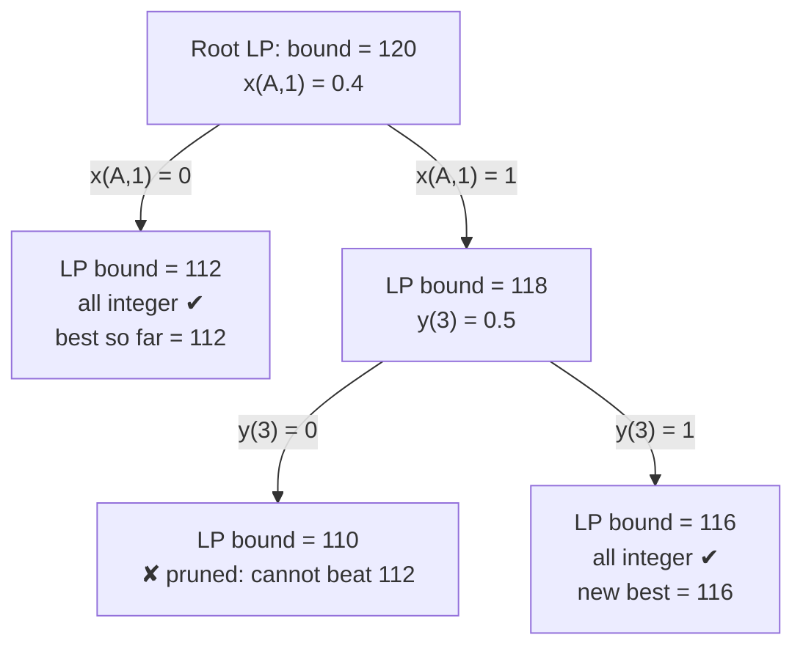

# MILP Solver Algorithm Explanation

This project uses **Mixed Integer Linear Programming (MILP)** to solve the pet dispatch assignment problem. Unlike traditional recursive search, MILP can find the global optimal solution across multiple tasks simultaneously while respecting complex constraints.

## Core Objective

The goal is to maximize the **Total Rewards** (carrots) across all selected jobs, while minimizing the number of borrowed pets in case of a tie. Additionally, the solver prioritizes using a smaller team when the reward tier and the number of borrowed pets would be the same.

$$ \text{Maximize } \left( \sum_{j \in Jobs} \sum_{t \in Tiers} R(t) \cdot v_{j,t} \right) - \left( 0.0001 \cdot \sum_{w \in Owned} \sum_{j \in Jobs} x_{w,j} \right) - \left( 0.01 \cdot \sum_{w \in Borrowed} \sum_{j \in Jobs} x_{w,j} \right) $$

where $v_{j,t}$ is a binary variable that is 1 if job $j$ achieves reward tier $t$, and $R(t)$ is the actual carrot reward for that tier. $x_{w,j}$ is 1 if worker $w$ is assigned to job $j$.

### Tie-breaking Priorities

When multiple combinations yield the same reward, the solver uses these weighted penalties to break ties in order of importance:

1. **Prioritize Owned Pets**: Borrowed pets have a much higher penalty (0.01 vs 0.0001), so one borrowed pet costs as much as 100 owned pets. This ensures that if the same reward can be reached without borrowing, the solver will always prefer owned pets, even if that means a larger team.
2. **Minimize Team Size**: The base penalty (0.0001) ensures that if a pet doesn't push the score to the next tier, it will be left unassigned.

## Decision Variables

- $x_{w,j}$: Binary variable (1 if worker $w$ is assigned to job $j$, 0 otherwise).
- $y_j$: Binary variable (1 if job $j$ is selected to be run).
- $v_{j,t}$: Binary variable (1 if job $j$ reaches score tier $t$).

## Constraints

1. **Worker Uniqueness**: Each pet (owned or borrowed) can only be assigned to one job at a time.
2. **Global Borrow Limit**: The total number of borrowed pets across all jobs cannot exceed a global limit (default: 3).
3. **Active Job Limit**: Only a specific number of jobs (defined by user $P$) can be run simultaneously.
4. **Team Size**: Each job can have between 1 and 3 pets.
5. **Single Borrow per Job**: Each job can have at most one borrowed pet.
6. **Duplicate/Clone Prevention**: If a user owns a pet and also borrows a copy of the same pet, they cannot both be in the same team.
7. **Tier Validation**: A tier $t$ can only be claimed for job $j$ if the sum of raw pet scores in that team meets or exceeds the threshold $t$.

## Solver Implementation

The logic is implemented using the `PuLP` library in Python, which builds the model and hands it to the open-source **CBC** (COIN-OR Branch and Cut) solver. CBC finds and proves the optimal assignment in a fraction of a second.

### Why Integer Variables Matter

All decision variables are declared with `cat='Binary'`, which tells the solver that each one must be exactly 0 or 1. Without this requirement the problem becomes an ordinary linear program (LP), whose "best" answer could be meaningless, e.g. assigning 0.4 of one pet and 0.6 of another to a job. CBC combines the following techniques to find the best whole-number answer.

### 1. LP Relaxation

CBC first solves the **LP relaxation**: the same objective and constraints, but every variable may take any value between 0 and 1. LPs solve very quickly. Because the relaxation allows more freedom than the real problem, its objective value is an **upper bound**: no real assignment can earn more. If every variable already happens to be 0 or 1, that solution is optimal and CBC is done.

### 2. Branch-and-Bound

Otherwise, CBC picks a fractional variable, say $x_{w,j} = 0.4$, and splits the problem into two subproblems: one with $x_{w,j} = 0$ and one with $x_{w,j} = 1$. Each subproblem is solved as an LP again, and the splitting repeats, forming a search tree:

*(Illustrative numbers.)* Whenever a branch's LP bound is no better than the best whole-number solution found so far, the branch is **pruned**: nothing below it can win. This is what lets CBC avoid enumerating every possible team combination.

### 3. Cutting Planes

To shrink the tree further, CBC adds **cuts**: extra linear inequalities that every valid whole-number assignment satisfies, but that the current fractional LP solution violates. A cut removes the fractional point without removing any real assignment, so the LP bound gets tighter and fewer branches are needed. CBC generates cuts automatically, mainly by rounding the coefficients of existing constraints and by spotting logical implications between variables (e.g. "these pets can't all be on the same team" or "this tier is only reachable if pet A is on the team").

**Example from this model:** suppose a tier requires a score of 45, and the only useful pets score A = 30, B = 20 and C = 20. Every real team that reaches 45 must include A, since B + C is only 40. But the LP relaxation can claim the tier with $x_A = 0.5$ and $x_B = x_C = 1$: the score is 15 + 20 + 20 = 55 ≥ 45 with a "team size" of 2.5 ≤ 3. The cut $v_{j,t} \le x_{A,j}$ holds for every real team but rules out this fractional one.

### 4. Proven Optimality

CBC stops when no unexplored branch has a bound better than the best whole-number solution found. At that point the solution is **proven** globally optimal, and PuLP reports the status `Optimal`. This is the key difference from greedy or heuristic approaches: the result is guaranteed to be the best possible assignment under the given constraints. If the status is anything else, the app returns an empty result.

> **Tip:** To watch the solver work, change `msg=0` to `msg=1` in the `PULP_CBC_CMD(...)` call in `src/core/assignment.py`. CBC will then print the root LP bound, how many cuts each generator added, and the branch-and-bound progress.
